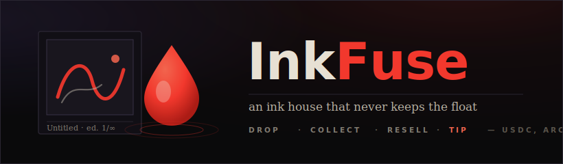

# InkFuse

*A catalogue for an ink house that never closes its doors, and never keeps the float.*

There is an old, quiet dishonesty in how drawings get sold. A sketch leaves the artist's hands once, for one sum, and every life it lives afterward — every resale, every quiet appreciation in someone else's collection — happens in a room the artist is no longer allowed to stand in. InkFuse is a small attempt to rebuild that room so the artist is always still inside it.

It is not a minting button. It is the whole house around a piece of work: the wall it first hangs on, the market where it changes hands, the royalty that follows it like a shadow, and the open hand of patronage. A drawing here is not an event that happens once. It is a thing that keeps earning for the person who made it, for as long as anyone still wants it.

## The artist's statement

I wanted the economics of a drawing to be as visible and as honest as the drawing itself. So nothing here is held in trust, nobody's, escrowed, or "settled later." When you collect a piece, the payment is already with the artist before the transaction has finished confirming — the contract pays out in the same call that records your ownership. When you resell, the split is not a promise to reconcile accounts at the end of the month; it is two transfers that leave the contract in the same breath as the handover. The ledger is the gallery. What you see on the wall is what the chain says is true.

## The four motions

A piece moves through this house in four ways, and only four.

**To drop.** An artist calls `drop(uri, title, price, cap, royaltyBps)` and a sketch goes up on the wall — an image, a title, a per-edition price in USDC, an edition cap (leave it zero for an open edition), and the royalty that will trail every future sale. That royalty is bounded; the contract refuses anything above `MAX_ROYALTY_BPS`, twenty percent, so no piece can be set to bleed its own collectors dry.

**To collect.** A visitor calls `collect(sketchId)` and mints the next edition. The price they send lands on the artist's address inside that same transaction — `primaryVolume` and the artist's lifetime `artistEarned` tick up, a numbered edition is written into their name, and the money is simply gone from the contract to the maker. No intermediary ever holds it.

**To resell.** Any edition can be hung back on the market with `list(editionId, price)` and taken down again with `delist`. When someone calls `buy(editionId)`, one settlement does the entire arithmetic of a secondary sale: the contract computes `royalty = price × royaltyBps / 10000`, sends that first to the original artist, sends the remainder to the seller, and rewrites ownership — all before the call returns. The artist gets paid on a sale they were not party to, automatically, every time the work changes hands. Any overpayment falls to the seller; nothing is skimmed by the house, because there is no house account.

**To tip.** And because admiration does not always wait for a purchase, `tip(sketchId)` sends USDC straight to the artist, patronage with no edition attached, recorded in `tipsPaid` and folded into what the artist has earned.

Sketches, editions, volumes, royalties routed home, tips given — all of it is public and read directly from the contract. Your collection and the pieces you have dropped are, in the end, just an on-chain reading of who owns what.

## Why this house can only stand on Arc

Everything above turns on a single uncomfortable detail: the resale. Picture a piece that sold for sixty cents being resold for ninety. The contract must, inside one transaction, peel a few cents of royalty to one address and route the balance to another — two parties paid out of one sub-dollar payment, atomically, with no chance of one leg landing and the other failing into limbo. That is the kind of money movement most chains make a lie. The moment the royalty is a fraction of a cent and the gas to move it costs more than the royalty itself, the honest split quietly stops happening — it gets batched, deferred, rounded away, or simply dropped, and the artist's shadow-income evaporates into rounding error.

Arc is the reason the split can stay honest. Value here moves in native USDC — the unit of the sale is the unit that settles, so there is no separate gas token to acquire, no allowance to pre-approve, no swap standing between a collector and a ninety-cent purchase. A multi-party division of a near-zero amount clears instantly and costs almost nothing to perform, which means the contract can afford to do the right thing on every single resale rather than only on the ones large enough to justify the overhead. Micro-prices, trailing royalties, and spontaneous tips are not features bolted onto a payment network; on Arc they are simply what a payment is. Take away that cheap, instant, native settlement and InkFuse degrades into the same old single-sale gallery it was built to replace.

## Honest scope

InkFuse is one deployed contract and a reader that talks to it — collectors sign their own collects, resales, and tips from their wallet; the chain is the only backend. The one server route in the project does nothing financial: it accepts an uploaded image for a new drop and hands back a URL, a convenience for artists who would rather not paste a link. There is no autonomous agent operating this market and no off-chain settlement service. The contract holds no admin keys over your editions; once a piece is yours, only your signature moves it.

---

InkFuse · contract `0x69e7dc5CA22a76538Ba059F175E939336b5E4b24`, Arc Testnet (chain 5042002) — [view on ArcScan](https://testnet.arcscan.app/address/0x69e7dc5CA22a76538Ba059F175E939336b5E4b24) · [inkfuse-arc.vercel.app](https://inkfuse-arc.vercel.app)
