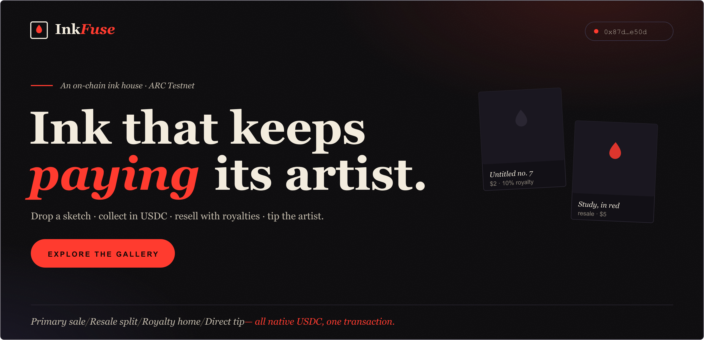

  

# InkFuse

*The gallery takes 0% — and the artist keeps getting paid on every resale.*

**→ [inkfuse-arc.vercel.app](https://inkfuse-arc.vercel.app)**

---

Most "mint" apps stop at one transaction. InkFuse is the whole room around the work — a primary
drop, a resale market, royalties and patronage — so the economics of a piece live entirely on-chain.

A sketch is dropped as an edition with a price, an edition cap and a resale royalty. Collectors mint
it; the USDC lands with the artist on the spot. Any edition can be re-listed, and when it resells the
contract pays the royalty home and the remainder to the seller **in the same transaction**. Anyone can
tip an artist directly. One piece, four money flows, no middleman holding the float.

## The flows

| Action | On-chain |
| --- | --- |
| `drop(uri, title, price, cap, royaltyBps)` | mint a sketch edition |
| `collect(sketchId)` | buy a primary edition — USDC straight to the artist |
| `list / delist(editionId)` | put an edition on, or off, the market |
| `buy(editionId)` | secondary sale — royalty to the artist **+** rest to the seller, one tx |
| `tip(sketchId)` | send the artist USDC directly |

Sketches, editions and earnings are public; your collection and your drops are your on-chain identity.

## Why ARC

A few-cent edition only clears where moving money is instant and basically free. ARC settles in
**native USDC** — no token to buy, no gas dance, no approval — and pays out the same second. A resale
splits itself in a single transaction, and every listing is an open `buy()` an agent can sweep. That
combination is what makes a real art economy — micro-prices, royalties, tips — practical here.

## Stack

`Next.js 16` · `React 19` · `ethers v6` · one `Solidity 0.8.35` contract · EIP-6963 wallets · no
backend; the gallery reads straight from the chain.

Contract
[`0x69e7dc5CA22a76538Ba059F175E939336b5E4b24`](https://testnet.arcscan.app/address/0x69e7dc5CA22a76538Ba059F175E939336b5E4b24)
— verified on ARC Testnet (chain `5042002`).
